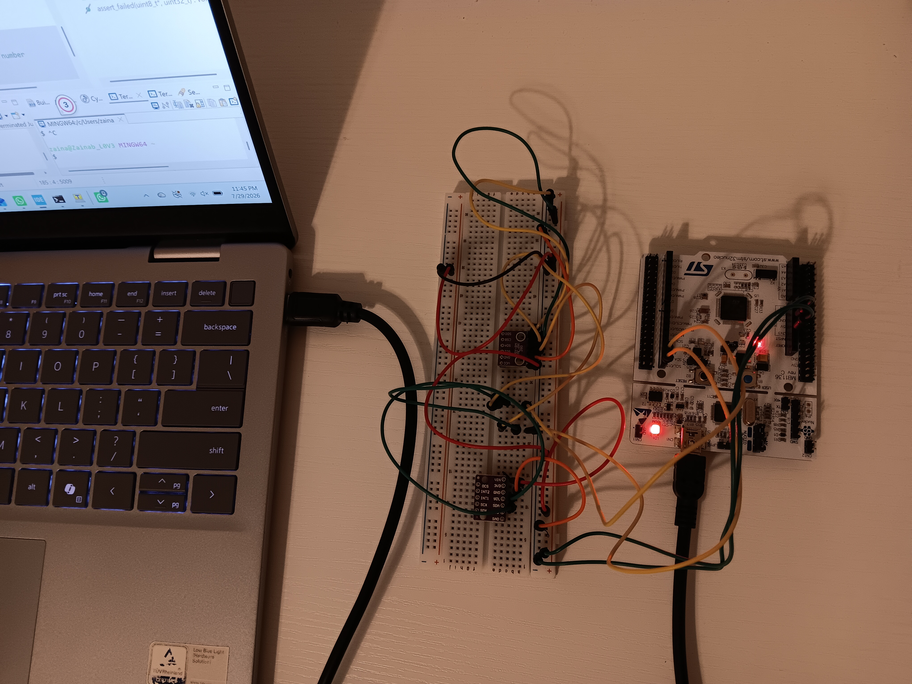
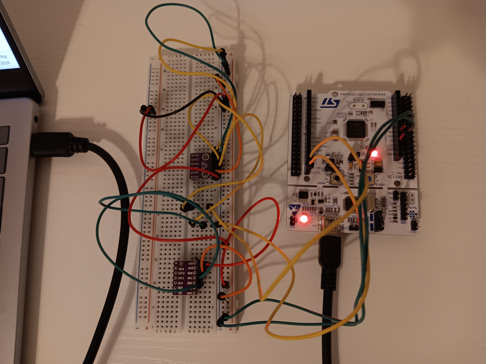
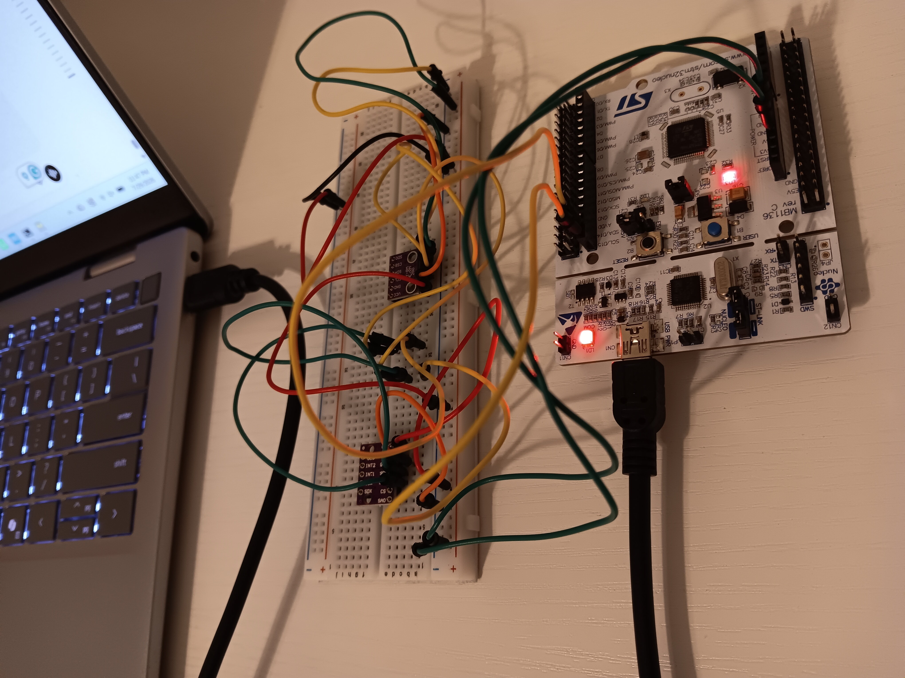
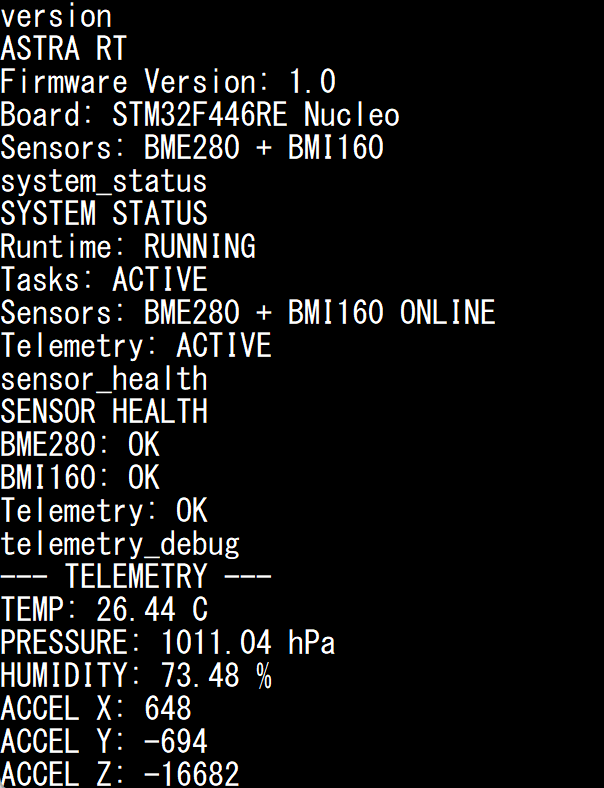
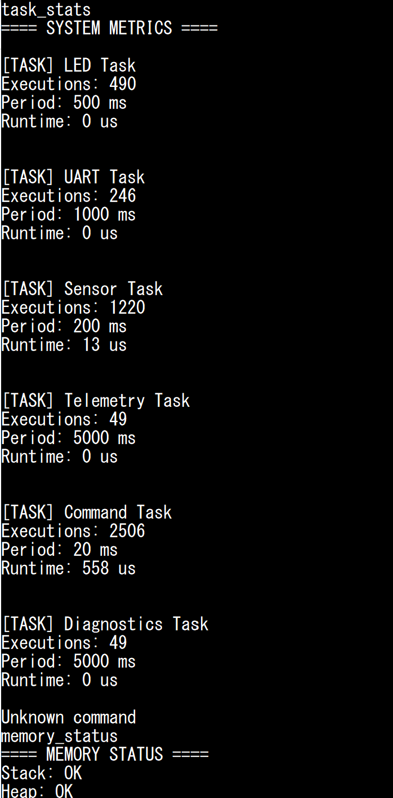

# AstraRT 

A modular STM32 embedded runtime framework designed for sensor integration,
hardware abstraction, telemetry, and real-time control systems.

## Overview

AstraRT is an embedded systems platform built around the STM32F446RE
microcontroller. It provides a structured software architecture for
hardware drivers, runtime services, and application-level tasks.

The goal is to create a reusable embedded framework for robotics,
IoT devices, and flight-computer style systems.

## Features

- Hardware abstraction layer (HAL)
- Sensor driver framework
- Runtime scheduler
- Task management
- Telemetry services
- Command interface
- Modular peripheral drivers

## Architecture

Platform/
│
├── Application/
│ └── Application tasks
│
├── Drivers/
│ ├── BME280
│ └── BMI160
│
├── HAL/
│ ├── GPIO
│ ├── I2C
│ ├── SPI
│ └── UART
│
├── Runtime/
│ ├── Scheduler
│ └── Task system
│
└── Services/
├── Telemetry
├── Protocol
└── Memory

## Hardware

Current target:

- STM32F446RE
- BME280 environmental sensor
- BMI160 IMU
- UART communication
- I2C peripherals
- SPI peripherals

## Hardware Setup

## Runtime Demonstration

AstraRT provides a UART command interface for runtime diagnostics,
sensor monitoring, and telemetry debugging.

Available commands:

- system_status
- sensor_health
- sensor_errors
- telemetry_debug
- memory_status
- uptime
- version

### Runtime Health Monitoring

### Runtime Metrics

## Current Status

Active development

Current focus:
- Driver validation
- Runtime expansion
- Telemetry implementation

## Roadmap

Future goals:

- Real-time telemetry dashboard
- Additional sensor support
- Logging system
- Flight-computer applications
